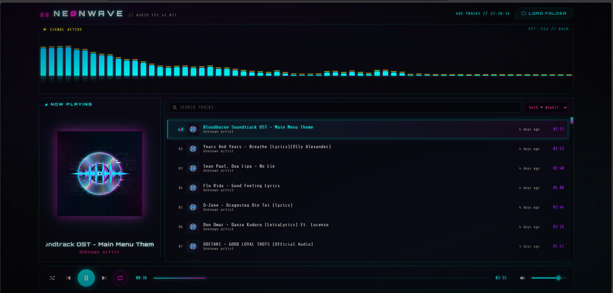

# NEØNWAVE // Cyberpunk Music Player


A single-page, browser-based music player with a cyberpunk/neon aesthetic and a
real-time **CAVA-style audio visualizer** — 64 reactive frequency bars with neon
cyan→magenta gradients, falling peak markers, and a mirrored reflection.

Built with **pure HTML, CSS, and vanilla JavaScript** (no frameworks). Vite is
used only as a bundler; all runtime code is hand-written ES modules.

 

## Features

- **Local folder loading**
  - **Method A:** File System Access API (`showDirectoryPicker`) with recursive
    folder scanning (Chrome / Edge).
  - **Method B:** Fallback `<input webkitdirectory>` + full-page drag & drop of
    files **and** folders (Firefox / Safari).
  - Supported formats: `mp3` `wav` `ogg` `flac` `aac` `m4a`.
- **Metadata extraction** via [jsmediatags](https://github.com/aadsm/jsmediatags)
  (title / artist / album / embedded album art) with filename fallback, plus
  duration probing and `lastModified` date-added tracking.
- **Track list**: real-time search (debounced), 8 sort modes (date added,
  title, artist, duration — asc/desc), relative "date added" display, lazy
  album-art thumbnails, glowing highlight + animated EQ bars on the playing row.
- **Player**: Web Audio API graph (`MediaElementSource → Analyser → Gain`),
  play/pause, next/prev, draggable neon seek bar, volume slider with 4-state
  speaker icon, mute, shuffle, 3-state repeat (off → all → one).
- **Visualizer**: `AnalyserNode` (fftSize 512) → 64 log-spaced bars rendered on
  canvas at 60fps with eased attack/decay, rounded tops, glow, falling peaks,
  reflection, and a gentle idle pulse when silent.
- **MediaSession API**: OS media controls show track info + art and drive
  play/pause/next/prev/seek.
- **LocalStorage persistence**: volume, mute, shuffle, repeat mode, and last
  played track (re-cued by filename when you reload the same folder).
- Neon-styled **toast notifications** for errors, warnings, and status changes.

## How to run

```bash
npm install
npm run dev        # development server
npm run build      # produces a self-contained dist/index.html
```

Then open the printed URL in **Chrome or Edge** for the full experience
(the build output `dist/index.html` can simply be opened / served statically).

Click **LOAD FOLDER** (or drag a music folder onto the page) and press play.

## Keyboard shortcuts

| Key        | Action                       |
| ---------- | ---------------------------- |
| `Space`    | Play / Pause                 |
| `→`        | Next track                   |
| `←`        | Previous track / restart     |
| `↑` / `↓`  | Volume up / down             |
| `M`        | Mute / unmute                |
| `S`        | Toggle shuffle               |
| `R`        | Cycle repeat: off → all → one|

## Browser compatibility

| Browser         | Folder picker | Drag & drop | Playback + visualizer |
| --------------- | ------------- | ----------- | --------------------- |
| Chrome / Edge   | ✅ FS Access API | ✅       | ✅                    |
| Firefox         | ⚠ fallback input | ✅       | ✅                    |
| Safari          | ⚠ fallback input | ✅       | ✅ (no FLAC)          |

> Browsers cannot persist filesystem permissions across sessions from a plain
> page, so you'll need to re-select your folder after a reload — your settings
> and last-played track are remembered.

## Project structure

```
├── index.html              # page shell, fonts, jsmediatags CDN
├── src/
│   ├── css/style.css       # all cyberpunk styling
│   ├── js/
│   │   ├── app.js          # init, UI orchestration, shortcuts, persistence
│   │   ├── player.js       # Web Audio API playback engine
│   │   ├── visualizer.js   # canvas CAVA-style visualizer
│   │   ├── playlist.js     # track list, sorting, search, rendering
│   │   ├── fileLoader.js   # FS access, drag&drop, metadata extraction
│   │   └── utils.js        # time formatting, debounce, helpers
│   └── assets/
│       └── default-cover.png
└── README.md
```
